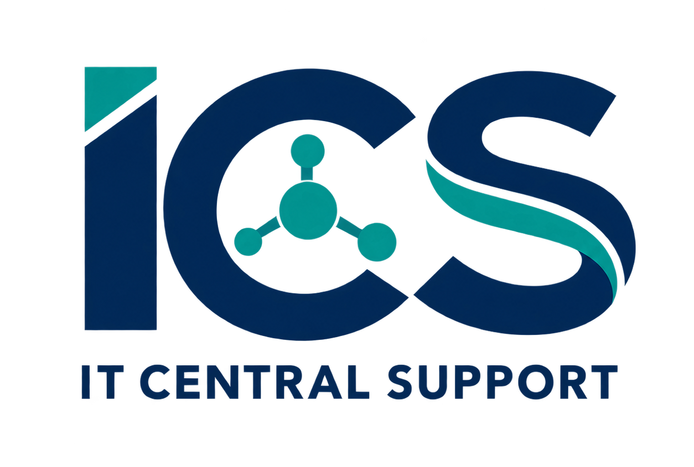
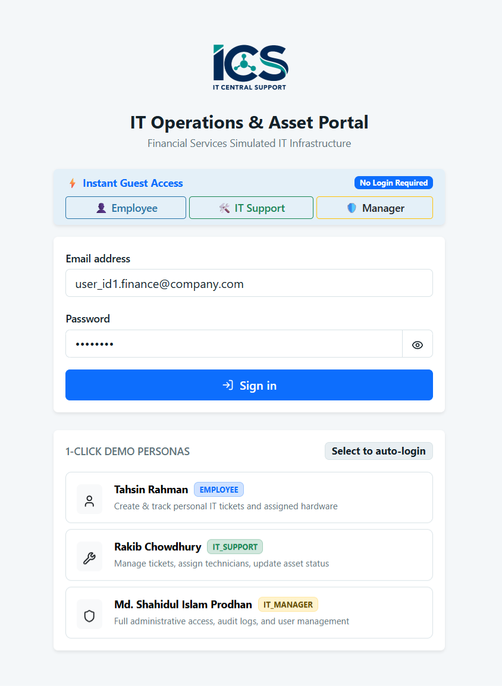
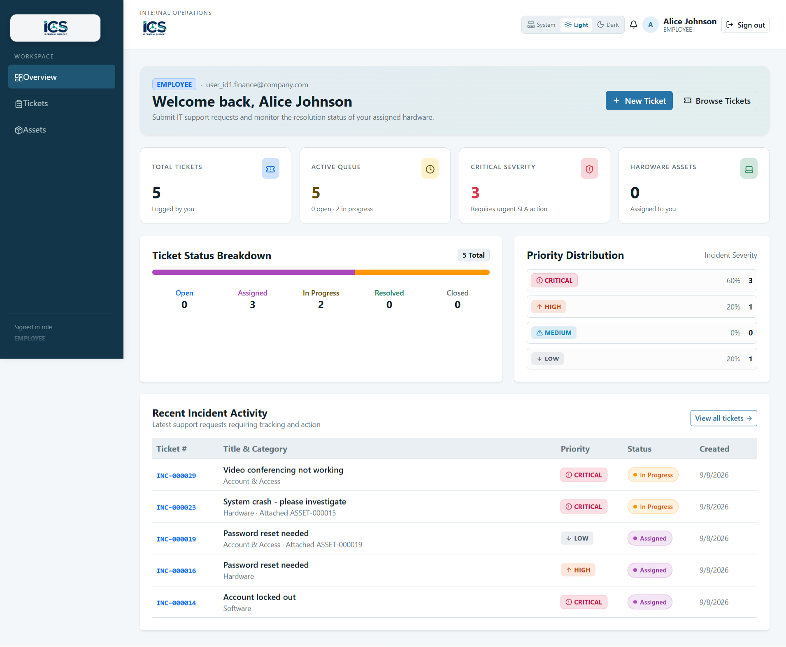
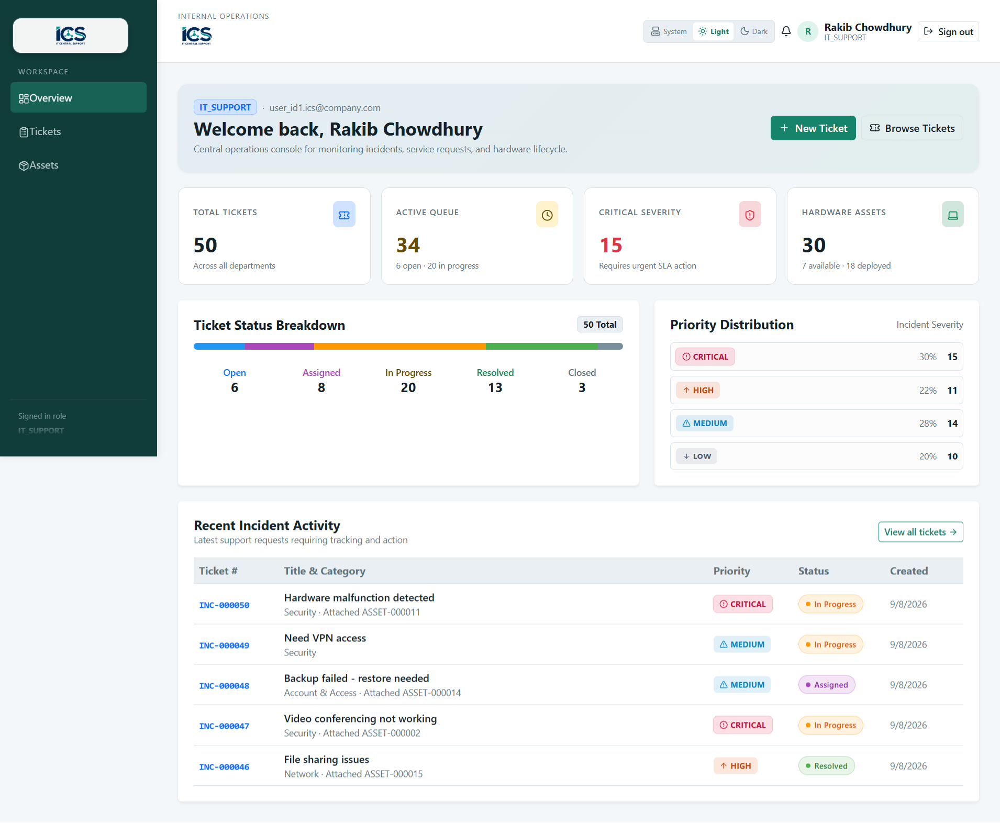
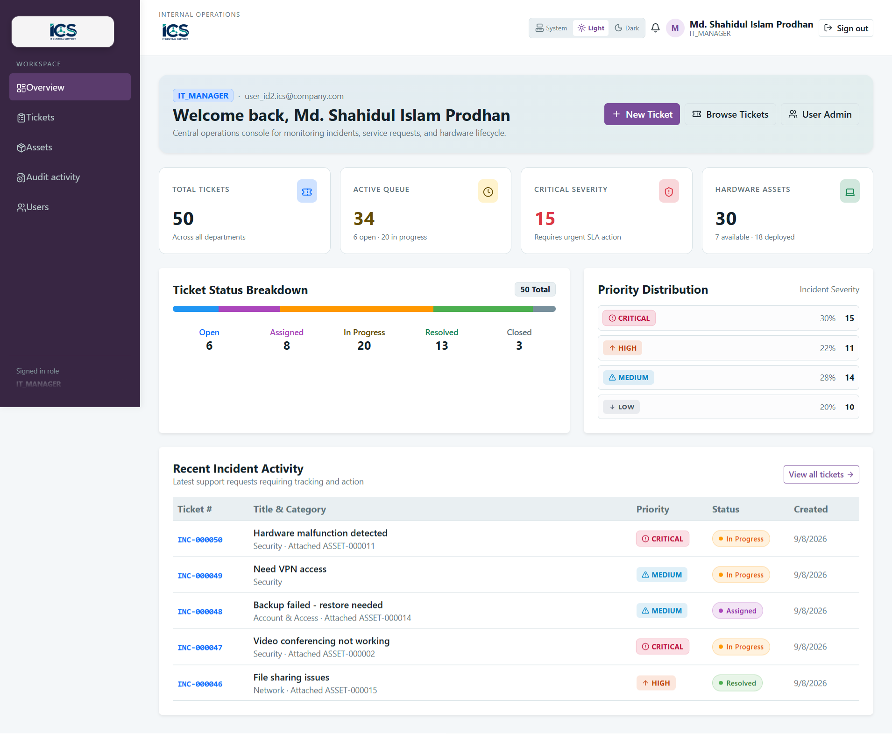
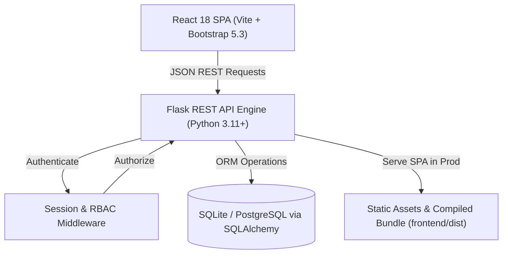

<div align="center">



# ICS — IT Central Support & Asset Management System

**An enterprise-grade internal IT operations platform built for modern business workflows, incident handling, and hardware asset lifecycle governance.**

[](https://www.python.org/)
[](https://flask.palletsprojects.com/)
[](https://react.dev/)
[](https://vitejs.dev/)
[](https://getbootstrap.com/)
[](https://www.postgresql.org/)
[](https://www.docker.com/)
[](https://render.com/)

<br />

### 🌐 **Live Web App**: [https://ics-it-central-support.onrender.com](https://ics-it-central-support.onrender.com)

<br />

[Live Demo](https://ics-it-central-support.onrender.com) •
[Key Features](#-key-features) •
[1-Click Demo Access](#-instant-1-click-guest-access) •
[UI Showcase](#-ui-showcase) •
[Architecture](#-system-architecture) •
[Installation](#-local-installation--quick-start) •
[Testing](#-testing--quality-assurance) •
[Deployment](#-production-deployment) •
[Docs](#-documentation-index)

</div>

---

## 📌 Executive Summary

**ICS (IT Central Support)** is a full-stack, internal operations web application designed to bridge the gap between organizational staff and technical support teams. It streamlines incident resolution, tracks hardware custody from procurement to decommissioning, maintains comprehensive audit logs, and enforces fine-grained role-based security across the enterprise.

### Core Objectives
- **End-User Empowerment**: Frictionless self-service ticketing with real-time progress and visibility over company-issued devices.
- **Operational Agility**: Centralized technician queues with live search, ticket status progression, priority indicators, and comment threads.
- **Asset Lifecycle Governance**: Complete physical equipment tracking including serial numbers, warranty deadlines, department allocation, and incident histories.
- **Managerial Compliance**: Immutable manager audit logs, employee directory management, and administrative safeguards.

---

## ⚡ Instant 1-Click Guest Access

No registration or manual credential entry required! The login screen provides **instant 1-click persona buttons** to test each level of authorization:

| Persona | Name | Role | Access Level & Capabilities |
| :--- | :--- | :--- | :--- |
| 👤 **Employee** | Tahsin Rahman | `EMPLOYEE` | **Self-Service**: Log IT issues, review assigned equipment, comment on personal tickets |
| 🛠️ **IT Support** | Rakib Chowdhury | `IT_SUPPORT` | **Operational**: Assign tickets, advance status workflow, register & update hardware inventory |
| 🛡️ **IT Manager** | Md. Shahidul Islam Prodhan | `IT_MANAGER` | **Executive Governance**: Manage user roles/status, inspect audit logs, full system oversight |

> 🚀 **Live Demo URL:** Open **[https://ics-it-central-support.onrender.com](https://ics-it-central-support.onrender.com)** to explore the live application directly in your browser!  
>  
> **Credentials (if typing manually):**  
> • Employee: `user_id1.finance@company.com` / `user_id1`  
> • IT Support: `user_id1.ics@company.com` / `user_id1`  
> • IT Manager: `user_id2.ics@company.com` / `user_id2`

---

## 📸 UI Showcase

### 1. Instant Guest Login
*Sleek, responsive authentication screen featuring 1-click role simulation, password visibility toggle, and secure session management.*



---

### 2. Employee Dashboard (Self-Service)
*Customized view for organizational staff displaying personal ticket counters, active support requests, and assigned physical assets.*



---

### 3. IT Support Specialist Dashboard (Operations)
*High-visibility technician hub highlighting open incident volume, assigned queues, pending resolutions, and quick access to hardware inventory.*



---

### 4. IT Manager Dashboard (Executive Governance)
*Comprehensive managerial control center featuring organizational performance metrics, department breakdowns, employee directory management, and system-wide audit activity.*



---

## 🌟 Key Features

### 🎫 Support Incident Management
- **Ticket Lifecycle**: Full workflow tracking across `Open` ➔ `Assigned` ➔ `In Progress` ➔ `Resolved` ➔ `Closed`.
- **Search & Filtering**: Live query search (`?q=`) across titles, descriptions, and ticket numbers, plus category and priority filtering.
- **Technician Assignment**: Reassign tickets to qualified specialists with audit traceability.
- **Interactive Collaboration**: Timestamped threaded comments between staff and IT technicians.
- **Resolution Documentation**: Enforced resolution notes upon closing incidents.

### 💻 Hardware Asset Management
- **Lifecycle Tracking**: Monitor hardware states: `Available`, `Assigned`, `Under Repair`, or `Retired`.
- **Hardware Profile**: Manufacturer, model, serial number, procurement date, warranty expiry, and notes.
- **Custodian Linking**: Associate physical workstations and devices directly to employees.
- **Incident History**: Inspect past tickets linked to any individual hardware unit.

### 🔒 Enterprise Security & Governance
- **Role-Based Access Control (RBAC)**: Strict permission boundaries for `EMPLOYEE`, `IT_SUPPORT`, and `IT_MANAGER`.
- **Session Security**: HTTP-only secure cookie sessions with Werkzeug password hashing.
- **Manager Audit Logging**: Every critical action (role promotion, account deactivation, ticket reassignment) logged with actor and timestamp.
- **Deactivation Protection**: Built-in safeguard preventing deactivation of the last remaining IT Manager.

### 🎨 Modern UI/UX Design
- **Dynamic Theming**: Instant toggle between Dark Mode and Light Mode with high-contrast text and accessible badges.
- **Role-Colored Navigation**: Distinct accent themes for Employee (Navy), IT Support (Emerald), and IT Manager (Royal Indigo).
- **Responsive Layout**: Fluid Bootstrap 5.3 grid optimized for desktop workstations, tablets, and mobile screens.

---

## 🏗️ System Architecture



### Technology Matrix

| Layer | Technologies |
| :--- | :--- |
| **Frontend UI** | React 18, Vite, Bootstrap 5.3, Lucide Icons, Axios, React Router v6 |
| **Backend API** | Python 3.11+, Flask 3.0, Flask-SQLAlchemy, Werkzeug, Gunicorn |
| **Database** | SQLite (development/testing) & PostgreSQL (cloud production) |
| **Testing** | pytest, pytest-flask, in-memory SQLite isolation |
| **Container & Cloud**| Docker, Docker Compose, Render Blueprint (`render.yaml`) |

---

## 💻 Local Installation & Quick Start

### Prerequisites
- **Python 3.10+**
- **Node.js 18+** & `npm`
- **Git**

### 1. Clone Repository
```powershell
git clone https://github.com/TheShahidul/ICS_IT-Central-Support.git
cd ICS_IT-Central-Support
```

### 2. Backend Setup
```powershell
# Create and activate virtual environment
python -m venv venv
.\venv\Scripts\Activate.ps1

# Install dependencies
pip install -r backend/requirements.txt

# Seed the database with realistic demo data
python -c "from backend.seed.seed_data import seed_database; seed_database()"
```

### 3. Frontend Setup
```powershell
cd frontend
npm install
npm run build
cd ..
```

### 4. Run Development Servers

**Option A: Separate Dev Servers (Recommended for Development)**

*Terminal 1 (Backend API):*
```powershell
cd backend
python app.py
# Running on http://localhost:5000
```

*Terminal 2 (Frontend Hot-Reload):*
```powershell
cd frontend
npm run dev
# Running on http://localhost:5173
```

**Option B: Production Mode (Flask serves compiled frontend):**
```powershell
cd backend
python wsgi.py
# Open http://localhost:5000 in your browser
```

---

## 🧪 Testing & Quality Assurance

The test suite validates authentication, role permissions, asset tracking, ticket workflows, and edge cases using an isolated in-memory SQLite database.

```powershell
# Run all backend tests
python -m pytest backend
```

### Test Coverage Highlights
```text
============================= test session starts =============================
tests/test_assets.py ....                                                [ 13%]
tests/test_auth.py .....                                                 [ 31%]
tests/test_edge_cases.py .....                                           [ 48%]
tests/test_phase1.py ....                                                [ 62%]
tests/test_tickets.py .......                                            [ 86%]
tests/test_users.py ....                                                 [100%]
============================= 29 passed in 9.61s ==============================
```

---

## 🚀 Production Deployment

### 🌐 Live Cloud Deployment
The application is deployed and live on Render:  
👉 **[https://ics-it-central-support.onrender.com](https://ics-it-central-support.onrender.com)**

### Deploying to Render.com (1-Click Blueprint)

The repository includes a ready-to-deploy [render.yaml](render.yaml) specification:

1. Create a free account on [Render.com](https://render.com).
2. Click **New +** ➔ **Blueprint**.
3. Connect repository `TheShahidul/ICS_IT-Central-Support`.
4. Render automatically provisions:
   - **Web Service**: Gunicorn WSGI Python container running Flask + React SPA.
   - **PostgreSQL Database**: Persistent relational database (or persistent disk for SQLite).
   - Automatic build execution via `build.sh`.

### Deploying via Docker Compose

Run the entire production stack locally or on any cloud VPS:

```bash
docker compose up --build -d
```
Visit `http://localhost:5000` to access the application.

---

## 📚 Documentation Index

For in-depth architectural and operational guides, consult the `docs/` directory:

| Document | Purpose |
| :--- | :--- |
| [architecture.md](docs/architecture.md) | High-level system design, security posture, and layer interactions |
| [database-design.md](docs/database-design.md) | Entity-Relationship schema, foreign keys, enums, and indexing strategy |
| [api-documentation.md](docs/api-documentation.md) | Full REST endpoint specifications with request/response examples |
| [deployment.md](docs/deployment.md) | Step-by-step production guides for Render, Docker, and Linux VPS |
| [user-guide.md](docs/user-guide.md) | Demonstration walk-throughs for each user persona |
| [testing.md](docs/testing.md) | Testing strategy, test suites, and regression checklists |

---

## 👤 Author & Maintainer

**Md. Shahidul Islam Prodhan**  
- GitHub: [@TheShahidul](https://github.com/TheShahidul)  
- Project: [ICS_IT-Central-Support](https://github.com/TheShahidul/ICS_IT-Central-Support)  

---

<div align="center">
  <sub>Built with ❤️ for enterprise operational excellence. Licensed under MIT.</sub>
</div>
